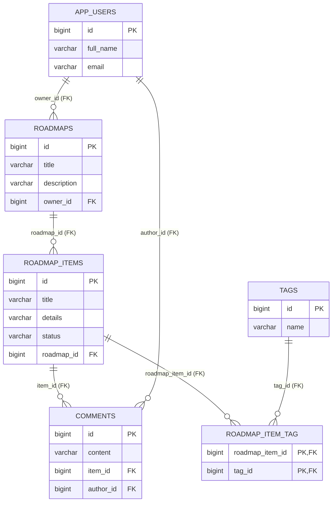

# RoadMap2026 - Лабораторная работа 2

Spring Boot REST API с PostgreSQL, JPA-сущностями и демонстрацией транзакций/N+1.

## 0. Автор
- Студент: **Могильный Владислав**
- Группа: **450503**

## 1. Структура проекта
```text
RoadMap2026/
├── .gitattributes
├── .gitignore
├── .mvn/
│   └── wrapper/
│       └── maven-wrapper.properties
├── .postman/
│   ├── RoadMap2026.code-workspace
│   └── config.json
├── .vscode/
│   ├── launch.json
│   └── settings.json
├── README.md
├── api.iml
├── docker-compose.yml
├── google_checks.xml
├── mvnw
├── mvnw.cmd
├── pom.xml
├── postman/
│   ├── RoadMap2026.postman_collection.json
│   ├── RoadMap2026_Lab2.postman_collection.json
│   ├── collections/
│   │   ├── RoadMap2026 API.postman_collection.json
│   │   └── RoadMap2026 Lab2 API.postman_collection.json
│   ├── environments/
│   │   └── New_Environment.postman_environment.json
│   └── globals/
│       └── workspace.postman_globals.json
└── src/
    ├── main/
    │   ├── java/
    │   │   └── com/example/roadmap/
    │   │       ├── RoadMap2026Application.java
    │   │       ├── bootstrap/
    │   │       │   └── DataInitializer.java
    │   │       ├── controller/
    │   │       │   ├── CommentController.java
    │   │       │   ├── RoadMapController.java
    │   │       │   ├── RoadMapItemController.java
    │   │       │   ├── TagController.java
    │   │       │   ├── TransactionDemoController.java
    │   │       │   └── UserController.java
    │   │       ├── dto/
    │   │       │   ├── CommentDto.java
    │   │       │   ├── CommentMapper.java
    │   │       │   ├── RoadMapDto.java
    │   │       │   ├── RoadMapItemDto.java
    │   │       │   ├── RoadMapItemMapper.java
    │   │       │   ├── RoadMapItemWithTagsDto.java
    │   │       │   ├── RoadMapMapper.java
    │   │       │   ├── TagDto.java
    │   │       │   ├── TagMapper.java
    │   │       │   ├── TransactionDemoRequestDto.java
    │   │       │   ├── TransactionDemoResultDto.java
    │   │       │   ├── UserDto.java
    │   │       │   └── UserMapper.java
    │   │       ├── exception/
    │   │       │   └── ResourceNotFoundException.java
    │   │       ├── model/
    │   │       │   ├── Comment.java
    │   │       │   ├── ItemStatus.java
    │   │       │   ├── RoadMap.java
    │   │       │   ├── RoadMapItem.java
    │   │       │   ├── Tag.java
    │   │       │   └── User.java
    │   │       ├── repository/
    │   │       │   ├── CommentRepository.java
    │   │       │   ├── RoadMapItemRepository.java
    │   │       │   ├── RoadMapRepository.java
    │   │       │   ├── TagRepository.java
    │   │       │   └── UserRepository.java
    │   │       └── service/
    │   │           ├── CommentService.java
    │   │           ├── CommentServiceImpl.java
    │   │           ├── RoadMapItemService.java
    │   │           ├── RoadMapItemServiceImpl.java
    │   │           ├── RoadMapService.java
    │   │           ├── RoadMapServiceImpl.java
    │   │           ├── TagService.java
    │   │           ├── TagServiceImpl.java
    │   │           ├── TransactionDemoService.java
    │   │           ├── TransactionDemoServiceImpl.java
    │   │           ├── TransactionWorkerService.java
    │   │           ├── TransactionWorkerServiceImpl.java
    │   │           ├── UserService.java
    │   │           └── UserServiceImpl.java
    │   └── resources/
    │       └── application.properties
    └── test/
        ├── java/
        │   └── com/example/roadmap/
        │       └── RoadMap2026ApplicationTests.java
        └── resources/
            ├── application.properties
            └── mockito-extensions/
                └── org.mockito.plugins.MockMaker
```

## 2. Что реализовано по заданию
1. Реализовано Spring Boot приложение с PostgreSQL.
2. В модели данных реализовано 5 сущностей:
- `User`
- `RoadMap`
- `RoadMapItem`
- `Tag`
- `Comment`
3. Реализованы связи:
- `OneToMany`: `RoadMap -> RoadMapItem`, `RoadMapItem -> Comment`, `User -> RoadMap`
- `ManyToMany`: `RoadMapItem <-> Tag`
4. Реализован полный CRUD для всех 5 сущностей.
5. Настроены и обоснованы `CascadeType` и `FetchType`.
6. Продемонстрирована проблема N+1 и решение через `@EntityGraph` и `fetch join`.
7. Реализован сценарий сохранения нескольких связанных сущностей:
- без `@Transactional` -> частичное сохранение
- с `@Transactional` -> откат всей операции при ошибке
8. Подключение к БД выполнено через Docker контейнеры.

## 3. Запуск через Docker
В проекте есть `docker-compose.yml`:
- `postgres` (порт `5433`)
- `pgadmin` (порт `5050`)

Запуск:
```bash
docker-compose up -d
```

Проверка:
```bash
docker-compose ps
```

Остановка:
```bash
docker-compose down
```

Параметры БД по умолчанию:
- DB: `roadmap_db`
- user: `roadmap_user`
- password: `roadmap_pass`

## 4. Запуск приложения
```bash
./mvnw spring-boot:run
```

Профиль по умолчанию подключается к PostgreSQL через:
- `spring.datasource.url=jdbc:postgresql://localhost:5433/roadmap_db`

Тесты запускаются на H2 (изолированно):
```bash
./mvnw test
```

## 5. ER-диаграмма (PK/FK)


### 5.1 DBML для dbdiagram.io (удобно для печати)
Скопируй код ниже в https://dbdiagram.io:

```dbml
Project RoadMap2026 {
  database_type: "PostgreSQL"
}

Enum item_status {
  PLANNED
  IN_PROGRESS
  DONE
}

Table app_users {
  id bigint [pk, increment]
  full_name varchar(120) [not null]
  email varchar(160) [not null, unique]
}

Table roadmaps {
  id bigint [pk, increment]
  title varchar(120) [not null]
  description varchar(500)
  owner_id bigint [not null, ref: > app_users.id]
}

Table roadmap_items {
  id bigint [pk, increment]
  title varchar(150) [not null]
  details varchar(800)
  status item_status [not null]
  roadmap_id bigint [not null, ref: > roadmaps.id]
}

Table tags {
  id bigint [pk, increment]
  name varchar(80) [not null, unique]
}

Table comments {
  id bigint [pk, increment]
  content varchar(600) [not null]
  item_id bigint [not null, ref: > roadmap_items.id]
  author_id bigint [not null, ref: > app_users.id]
}

Table roadmap_item_tag {
  roadmap_item_id bigint [not null, ref: > roadmap_items.id]
  tag_id bigint [not null, ref: > tags.id]

  indexes {
    (roadmap_item_id, tag_id) [pk]
  }
}
```

## 6. Обоснование CascadeType / FetchType
### 6.1 `RoadMap -> RoadMapItem`
- `cascade = CascadeType.ALL`
- `orphanRemoval = true`

Обоснование:
- элементы дорожной карты являются дочерними для `RoadMap`;
- при удалении `RoadMap` связанные `RoadMapItem` тоже должны удаляться;
- orphanRemoval удаляет «осиротевшие» элементы.

### 6.2 `RoadMapItem -> Comment`
- `cascade = CascadeType.ALL`
- `orphanRemoval = true`

Обоснование:
- комментарии логически принадлежат конкретному элементу;
- удаление элемента должно удалять его комментарии.

### 6.3 `RoadMapItem <-> Tag` (ManyToMany)
- `fetch = FetchType.LAZY`
- `cascade = {PERSIST, MERGE}`

Обоснование:
- теги могут переиспользоваться многими элементами;
- каскадное удаление `REMOVE` опасно: можно удалить общий тег для других элементов;
- `LAZY` снижает число лишних загрузок.

### 6.4 `ManyToOne` связи (`owner`, `item`, `author`)
- `fetch = FetchType.LAZY`

Обоснование:
- связь подгружается только когда действительно нужна;
- уменьшает нагрузку и объем SQL-запросов.

## 7. CRUD endpoints (все сущности)
### Users
- `POST /api/users`
- `GET /api/users`
- `GET /api/users/{id}`
- `PUT /api/users/{id}`
- `DELETE /api/users/{id}`

### RoadMaps
- `POST /api/roadmaps`
- `GET /api/roadmaps`
- `GET /api/roadmaps/{id}`
- `PUT /api/roadmaps/{id}`
- `DELETE /api/roadmaps/{id}`

### RoadMapItems
- `POST /api/roadmap-items`
- `GET /api/roadmap-items`
- `GET /api/roadmap-items/{id}`
- `PUT /api/roadmap-items/{id}`
- `DELETE /api/roadmap-items/{id}`

### Tags
- `POST /api/tags`
- `GET /api/tags`
- `GET /api/tags/{id}`
- `PUT /api/tags/{id}`
- `DELETE /api/tags/{id}`

### Comments
- `POST /api/comments`
- `GET /api/comments`
- `GET /api/comments/{id}`
- `PUT /api/comments/{id}`
- `DELETE /api/comments/{id}`

## 8. Демонстрация N+1
Включены SQL-логи в `application.properties`.

1. Вызвать endpoint с потенциальной N+1 загрузкой:
- `GET /api/roadmap-items/n-plus-one`

2. Вызвать оптимизированные endpoint'ы:
- `GET /api/roadmap-items/entity-graph`
- `GET /api/roadmap-items/fetch-join`

Ожидание в логах:
- для `n-plus-one` видно больше отдельных select'ов по тегам;
- для `entity-graph`/`fetch-join` число запросов меньше.

## 9. Демонстрация транзакций
Используется endpoint:
- `POST /api/transactions/without-transactional`
- `POST /api/transactions/with-transactional`

Пример body:
```json
{
  "ownerId": 1,
  "roadMapTitle": "Transaction Demo",
  "firstItemTitle": "First item",
  "secondItemTitle": "Second item"
}
```

Интерпретация результата:
- `without-transactional`: `roadMapsAfter/itemsAfter` увеличиваются (частичное сохранение).
- `with-transactional`: значения после ошибки не увеличиваются (полный rollback).

